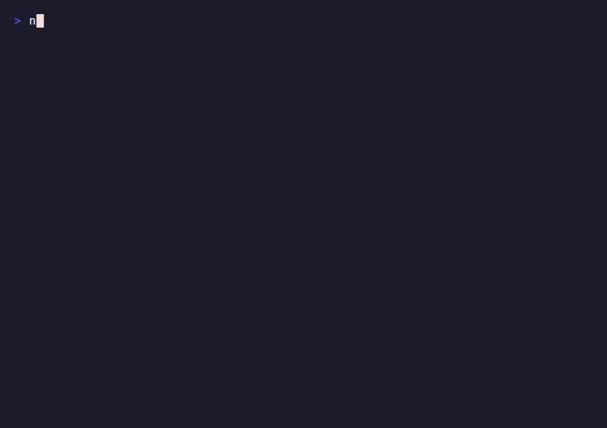

<div align="center">

# OpenA2A

**Open-source security for AI agents**

[Website](https://opena2a.org) | [Discord](https://discord.gg/uRZa3KXgEn) | [Email](mailto:info@opena2a.org)

> If these tools are useful to you, consider giving this repo a star. It helps others discover them.

</div>

---

## Quick Start

Block AI coding tools from reading your secrets:

```bash
npx secretless-ai init
```

<p align="center">
  
</p>

Scan your AI agent for vulnerabilities:

```bash
npx hackmyagent secure
```

<p align="center">
  
</p>

Add cryptographic identity to your agent:

```bash
pip install aim-sdk
```

---

OpenA2A builds open-source tools for securing AI agents in production. AI agents are the fastest-growing category of non-human identities, and most organizations have no governance, no visibility, and no security controls around them. We're building the infrastructure to fix that -- identity management, runtime protection, security scanning, compliance benchmarks, and credential management for AI developer tools. Everything is Apache-2.0, self-hostable, and designed to work independently or together.

## Projects

| Project | Description | Install |
|---------|-------------|---------|
| **[Secretless AI](https://github.com/opena2a-org/secretless-ai)** | Credential management for AI coding tools -- Claude Code, Cursor, Windsurf | `npx secretless-ai init` |
| **[HackMyAgent](https://github.com/opena2a-org/hackmyagent)** | Security scanner -- 147 checks, attack mode, auto-fix | `npx hackmyagent secure` |
| **[AI Browser Guard](https://github.com/opena2a-org/AI-BrowserGuard)** | Detect, control, and terminate AI agents in your browser | Chrome Web Store |
| **[AIM](https://github.com/opena2a-org/agent-identity-management)** | Identity & access management for AI agents | `pip install aim-sdk` |
| **[ARP](https://github.com/opena2a-org/arp)** | Agent Runtime Protection -- process, network, filesystem monitoring | `npm install @opena2a/arp` |
| **[OASB](https://github.com/opena2a-org/oasb)** | Open Agent Security Benchmark -- 222 attack scenarios | `npm install @opena2a/oasb` |
| **[DVAA](https://github.com/opena2a-org/damn-vulnerable-ai-agent)** | Deliberately vulnerable AI agents for security training | `docker pull opena2a/dvaa` |

## How They Fit Together

```
+----------------------------------------------------------+
|                      Your AI Agent                        |
|                                                           |
|  Secretless AI  -> Credential management for dev tools    |
|  HackMyAgent    -> Scan, harden, attack-test              |
|  AI Browser Guard -> Detect/control agents in browser     |
|  AIM            -> Identity, governance, access control   |
|  ARP            -> Runtime process/network/file monitoring|
|  OASB           -> Compliance benchmark (46 controls)     |
|  DVAA           -> Train your team on AI agent security   |
+----------------------------------------------------------+
```

## Upstream Contributions

We contribute security fixes back to the open-source projects we depend on and audit.

**[OpenClaw](https://github.com/open-webui/open-webui)** (205K+ stars) -- 8 security PRs (7 merged, 1 open):

- Credential redaction in gateway config responses ([#9858](https://github.com/open-webui/open-webui/pull/9858))
- Skill/plugin code safety scanner ([#9806](https://github.com/open-webui/open-webui/pull/9806))
- Path traversal prevention in A2UI file serving ([#10525](https://github.com/open-webui/open-webui/pull/10525))
- Security headers for gateway HTTP responses ([#10526](https://github.com/open-webui/open-webui/pull/10526))
- Timing-safe comparison for hook token auth ([#10527](https://github.com/open-webui/open-webui/pull/10527))
- Supply chain hardening with --ignore-scripts ([#10528](https://github.com/open-webui/open-webui/pull/10528))
- File permission enforcement for credential files ([#10529](https://github.com/open-webui/open-webui/pull/10529))
- Skill scanner false positive reduction ([#10530](https://github.com/open-webui/open-webui/pull/10530))

**[Nanobot](https://github.com/HKUDS/nanobot)** -- 1 security PR (open):

- Path traversal, XSS, and shell escape fixes ([#472](https://github.com/HKUDS/nanobot/pull/472))

## License

All projects are Apache-2.0.
